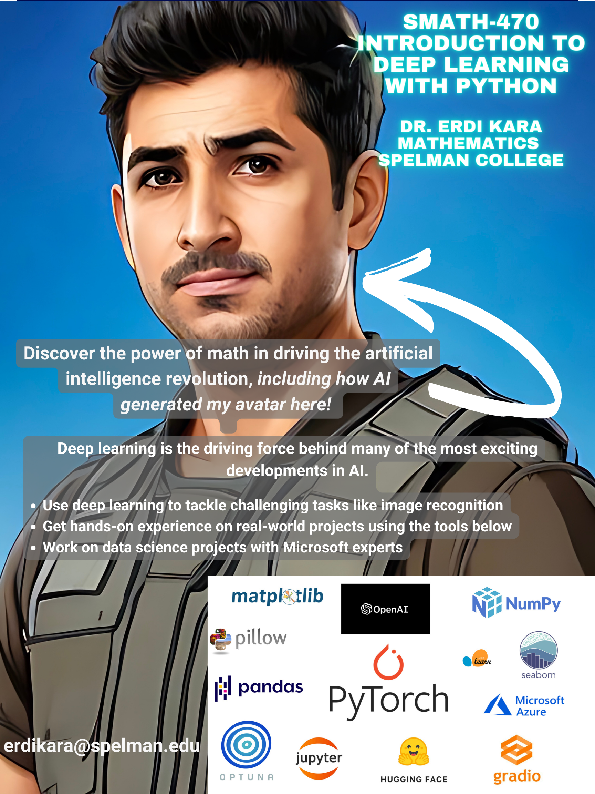

# Intro2-Deep-Learning-with-Pytorch

This repository contains of resources *SMATH 470-Introduction to Deep Learning  with Python* that I offer at the Mathematics Department of Spelman College. All materials, including lecture notes, notebooks and datasets will be posted here on regular basis. 

This repository assumes you have a local GPU. Because, once you start training neural network models, you will need a decent one, which you or your students may not have locally. The easiest way to deal with this issue is to set up the class on Google Colab. It comes with preinstalled Python libraries and a pretty powerful GPU. Loading data to your workspace is just a little bit hussle. To ease the process, you can use the following link to access our works on Colab. It is pretty much the same with the current Github repo but has some Colab special tweaks. 

[Access Google Colab](https://drive.google.com/drive/folders/1DSwIQBehaBteykUF1yOJa6gzE3hz57ED?usp=share_link)

*I would like to acknowledge AUC Data Initiative for their support in the creation of this class. I would also like to thank Microsoft’s data science  experts Anushka Madwesh, Kem Ezoeke, Mark Gazai, Nolen Code, Taisha Ferguson for providing excellent mentorship to students in this class throughout the semester and working with them on amazing projects. Finally, I would like to thank Microsoft for providing a Microsoft Azure Sponsorship as a cloud computing resource*.
